# Computer System Showcase

Computer System Showcase is a website that allows users to create posts with an image and information surrounding computer builds they have made to share them with other users of the site. Users can also show appreciation and share feedback on builds by liking posts and comments on posts.

The aim of this website is to give users who are computer enthusiasts a place to showcase, view and discuss their computer builds similar to other websites like builds.gg and the completed builds section on pcpartpicker.com. My way to try differentiate this website from those other two was by making it simpler overall as builds.gg feels very cluttered and both websites place some emphasis on the price of the builds where I wanted to focus this website on just the build itself regardless of price and have a simpler, easy to navigate UI.

- Live site:  [ComputerSystemShowcase](https://computer-system-showcase.herokuapp.com/).
- GitHub Repository:  [ComputerSystemShowcase Repo](https://github.com/alexkavanagh-dev/computer-system-showcase).

## Features

### Navigation Menu

- The navigation menu is at the top of the page and is not stickied there so it does not take up space through the site as the user scrolls around. 
- The ComputerSystemsShowcase logo is in the left side of the navbar and a navigation menu containing links to navigate the website is to the right.
- The navigation menu contains 7 items: 'Home', 'Builds', 'Sign up', 'Login', 'Admin Panel', 'Account' and a search icon and all items will either show or be hidden depending on whether the user is signed in or not or is also a superuser.
- The home, builds, signup, login and search show up when a user is not signed in and when they are signed in, signup and login are replaced with the 'Account' link. The account link contains a dropdown menu for 'Your Liked Posts' and 'Logout'.
- When the user is signed in as a superuser, the 'Admin Panel' link will also be shown to give easier access to the Django admin panel.
- The search icon contains a simple form in a dropdown menu to give users a way to search for specific terms through posts on the site. 

### Hero Image

- Shows an image that gives an immediate impression to the user of what ComputerSystemsShowcase is centered around i.e. custom computers.
- The welcome message overlayed on the hero image reinforces and expands from the hero image impression to let the user know they can share their own builds.
- One brightly colored button is overlayed on the hero image, labelled 'See Builds' giving the user a quick stand-out route to scroll down to the main content of the website. 

### Builds Section

- Shows a paginated list of posts from users with a thumbnail image, post title, author name, likes icon/button and a featured ribbon for featured posts.
- Both the title and thumbnail act as links to the post detail page to give the user quick options. The thumbnail has a zoom effect on hover to show it is interactive and similarly the title changes color on hover.
- The likes icon/button will show users how many people have liked a post and when a user is signed in, it will change to a button allowing a user to like the post themselves. Once a post is liked, the thumbs up icon will be filled in to indicate liked posts and can be clicked again to unlike a post. 
- The builds section is paginated by 12 so it will display 12 posts before additional posts will be put on to different pages. Once paginated, a next and previous button will show up when there is more pages and allows the user to go through different pages.
- The builds section is sorted by featured posts and then by creation date so featured posts will go to the top and then will be sorted by most recently made posts.   

### Post Detail Page

- This page displays the posts image larger, post description, likes icon/button and parts list that was supplied by the posts creator.
-  As on the homepage, the likes icon/button turns into the button when a user is logged in with the same behaviours.
- If the user on a post detail page matches the author of the post, an edit and a delete button will appear under the posts to allow the user to edit their post or delete it. The edit button will bring the user directly to the edit post page while the delete button will bring up a modal to confirm that the user wishes to delete their post. 
- Each post detail page has a comment section for users with accounts to leave comments about builds. Comments are sorted by newest first.
- Comments can be deleted by their author with a button that shows when that user is logged in. A modal will popup to confirm that the user wishes to delete their comment, warning them that it cannot be undone.
- When a comment is made it must be approved by an admin before that comment will show up for other users. Admin comments are approved by default though
- When a superuser is logged in, an additional section for unnapproved comments will appear to show admins comments that are awaiting approval. Admins can choose to approve or delete those comments directly from here instead of the admin panel. 

### Add Your Build Page

- This page allows users to fill out a form to create a post of their own to share their builds.
- There is a form that the user can fill out with the relevant fields from the Post model to make their post.
- The field for the main image is a cloudinary field that will save the image a user uploads to cloudinary and allow it to be used on the site

### Search

- The search dropdown in the navbar allows a user to submit a search query to check against posts on the website.
- When a user submits a search, the model for Post is filtered down for fields that contain the users search query.
- Search results are displayed in the same way as on the builds section of the homepage

### Accounts

- Accounts on this website are handled by allauth and allow users to make accounts using a username, password and optional email.
- Making an account allows a user to interact with more features on the website such as creating posts and liking posts.
- Signed in users will gain access to a page called 'Your Liked Posts' under the account dropdown which will find all the posts that user has liked and then display them similar to the search page and builds section of the homepage.

### Like Posts

- Users can easily like posts by clicking the thumbs up button on a post when signed in
- The post will be liked, the like counter will increment and the thumbs up icon will fill in to indicate that a post is liked by that user. 
- Posts can be returned back to the unliked state by just clicking the button again

### Edit Posts

- When a user is logged in and views their own post detail page they can click the edit button to go to a page to edit their posts
- The edit post page is very similar to the add post page and uses the same form.
- When loaded, the edit post page will pre load the form with the current information on the selected post and the user can edit/update information and the image before resubmitting to edit their post

### Delete Posts/Comments

- If a user wishes to delete their post or comment they can click the delete button on a posts page or next to their comments. 
- A popup modal will appear asking the user to confirm that they wish to delete as this action cannot be undone. 
- After clicking delete the second time, their post or comment will be deleted from the database. 

### Featured Posts

- A superuser can set featured posts from either the admin panel or using the button that appears on a posts page when logged in as a superuser. 
- Featured posts are posts curated by the site admin for standing out in quality.
- Featured posts will be sorted to the top of the post list on the homepage and get a special featured badge in the corner to indiciate they have been featured. 

### Footer

- The footer contains links similar to the main navigation at the top of the page excluding the 'Admin Panel' link and the 'Accounts' and 'Search' dropdowns.
- The footer has an extra link 'Back to Top' though for users to quickly go back to the top of their current page.

### Possible future features

- Confirm user email addresses on signup
- Use confirmed user emails to allow users to reset their password incase it was forgotten
- Sign up for account through your google account
- Allow users to upload multiple images for their posts instead of just one, creating a gallery
- Give users a profile page that will display all their posts, comments and liked posts
- Create a modal for images to popup and zoom in on for the post detail page
- Add more fields to the post model for more build information such as form factor, peripherals, theme, etc...
- Allow users to filter posts by form factor, main color and sort from oldest to newest etc...
- Allow users to delete their account
- Create slugs from more than just the title charfield, allowing users more options when creating their post title
- Use the fetch API with Django to update the page in the background when a post is liked without having to reload the page

## Database Structure
The entity relationship diagram for the models of this website is below showcasing the fields in each model and any relationships between them. 

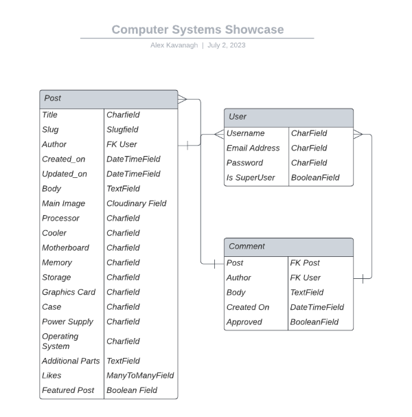

## Wireframes
I did the wireframes for this website by hand and I have pictures of them below. The pages for 'Search Results' and 'Your Liked Posts' were based largely on just the builds section of the homepage.
The design and layout of this website was influenced by other similar websites such as builds.gg and pcpartpicker.com.

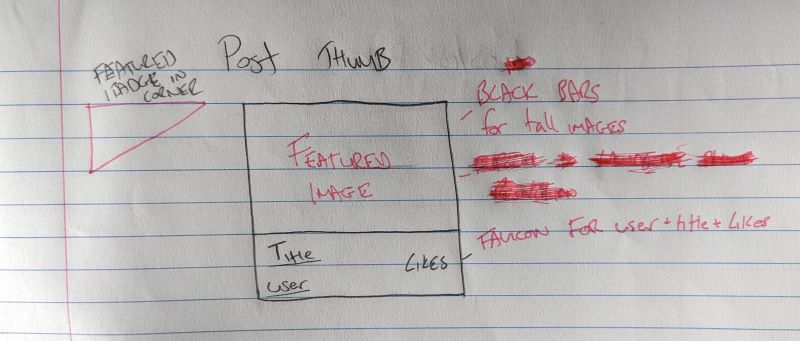
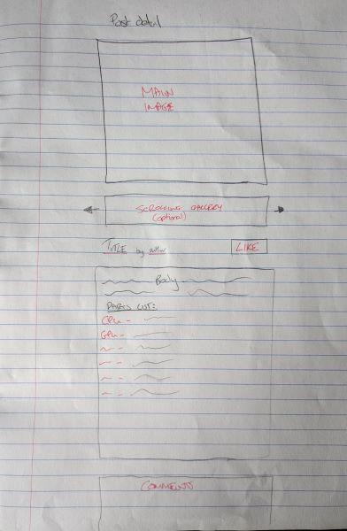
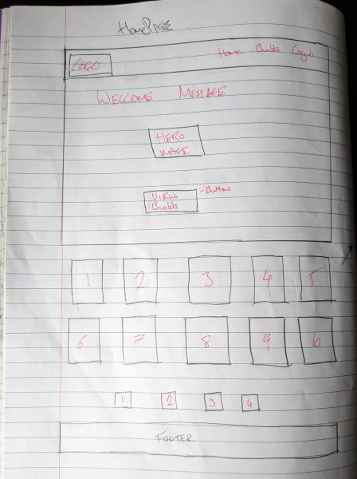

## User Stories & Epics
The Epics and User stories for this project were made and tracked using GitHubs projects page. User stories were sorted into the 4 Epics here:
- Administration
- Registration and Accounts
- Posts and Comments
- User Interface 

Each user story was sorted into the most relevant epic, given acceptance criteria to follow and then given tasks that must be completed to consider that user story finished. All the user stories can be viewed on the github projects page used here:  [GitHub Projects Page](https://github.com/users/alexkavanagh-dev/projects/6).

## Sprints
This project was completed using the following sprint timelines:
#### Sprint 1 (07/05 - 12/05)
- Initial Django Setup
- Create Epics/User stories
- Create wireframes
- Create base template
- Create Logo 

#### Sprint 2 (13/05 - 20/05)
- Create admin site
- Database entity relationship diagram
- Create models
- Setup urls and views for homepage

#### Sprint 3 (22/05)
- Add post list to homepage
- Create featured badge for featured posts
- Add hero image to homepage
- Create post detail page

#### Sprint 4 (31/05 - 06/06)
- Install django allauth
- Change navigation links based on logged in status
- Style sign in, sign up and logout page 
- Add like button to posts
- Add comment form to post detail

#### Sprint 5 (07/06 - 14/06)
- Create page for adding posts
- Create ability for users to edit posts
- Create ability for users to delete their posts and comments
- Create page for 404 errors

#### Sprint 6 (15/06 - 20/06)
- Pagination for homepage
- Style add/edit post form pages
- Add message alerts for appropriate user actions
- Add buttons to approve comments and feature posts in the website
#### Sprint 7 (21/06 - 27/06)
- Disable email verification
- Add message for no comments on a post
- Make post thumbnail images link to post detail
- Add search functionality
- Create page for users to see their liked posts
- Styling/Alignment fixes
- Add login required decorator to appropriate views

#### Sprint 8 (28/06 - 03/07)
- Add pagination to search results and account liked posts
- Add page title blocks to templates
- Add favicon
- Various styling fixes
- Comment and clean up code
- Create readme
- Website testing
- SUBMIT PROJECT!

## Testing

### Validator Testing

#### HTML

- No errors are found when run through the [W3C MarkUp Validator](https://validator.w3.org/).

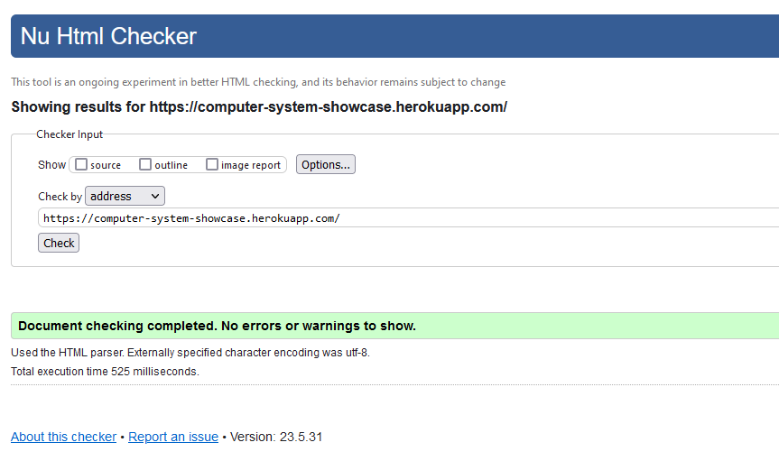

#### CSS

- No errors are found when run through the [W3C CSS Validator](https://jigsaw.w3.org/css-validator/).

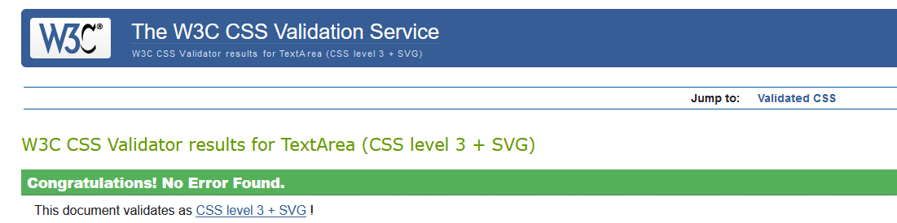

#### Performance

- I confirmed through the lighthouse tester in chrome devtools that performance on the website is adequate on both desktop and mobile devices.

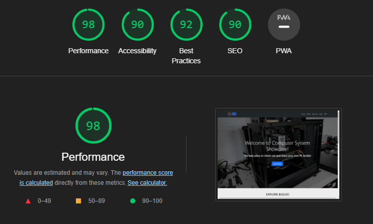
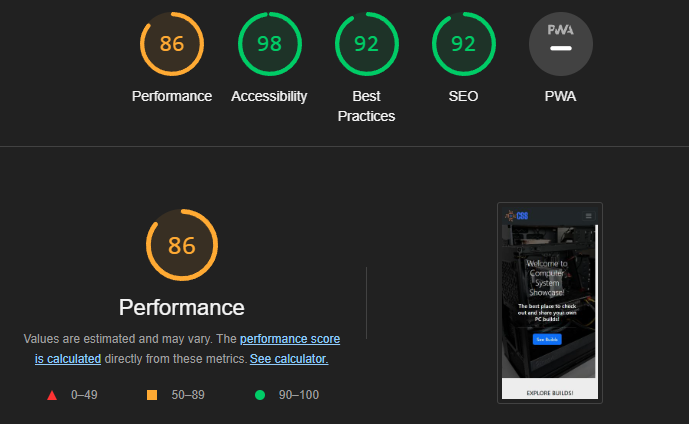

#### Javascript

- No errors are found when run through[JSHint](https://jshint.com/).

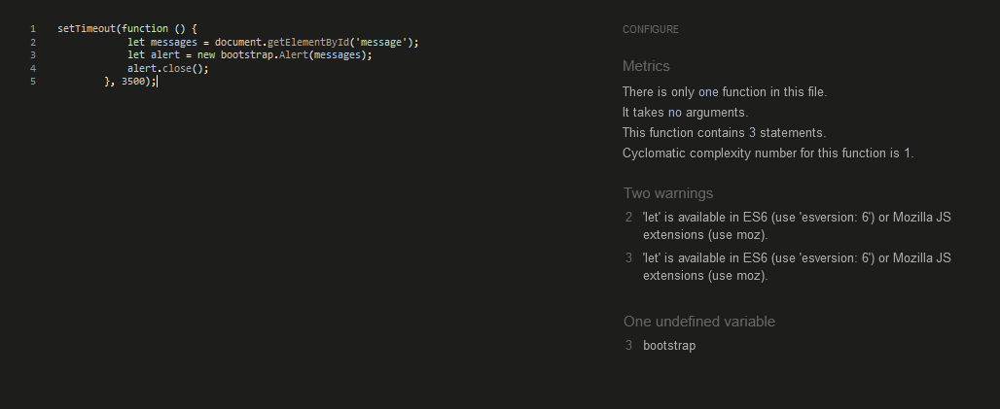

#### Python

- No errors are found when run through the [Code Institude Python Linter](https://pep8ci.herokuapp.com/).

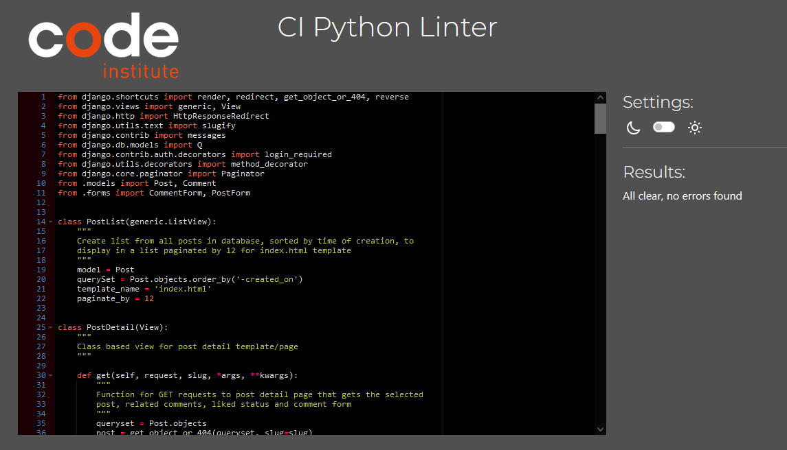

#### Accessibility

- No errors are found and contrast for accessibility is shown to be good through the [WAVE Evaluation Tool](https://wave.webaim.org/).

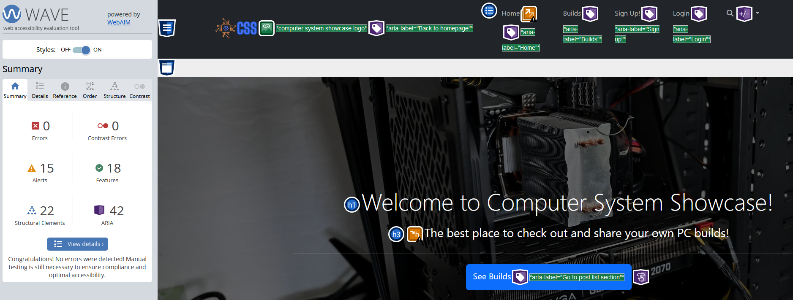

  

### Compatibility Testing

- I checked that the website functions as intended on different desktop browsers: Chrome, FireFox and Edge.
- I also checked the website functions properly on iphone and android devices.

### Responsive Testing

- I checked that the website is responsive, looks good and works well on different screen sizes as small as the iphone 5 using dev tools on a web browser.
- I checked that all links were still clickable throughout the page on mobile and brought you to the correct section of the page.
- I checked that all images and elements display properly across all screen sizes.

### Manual Testing

| Test Label             | Test Action                   | Expected Result                                                                                                                                                      | Test Outcome |
|------------------------|-------------------------------|----------------------------------------------------------------------------------------------------------------------------------------------------------------------|--------------|
| View Post List          | Load homepage    | Posts are listed with all correct information and image. Post list should be paginated when there is more than 12 posts.                                                                                       | PASS         |
| Open Post          | Click on a post title or thumbnail image    | The post detail page for the post clicked on will load up with all correct information and all approved comments for that post                                                                                                | PASS         |
| Create Post          | Click on Add your Build in navbar and fill out form   | A page containing a form to fill out information and an image for your build will load and once filled out and submitted, a post will be created and displayed on the website                                     | PASS         |
| Edit Post          | Click on edit button on a post    | A page will load with the current posts information and image that can be edited and resubmitted to edit information on a post                                                                                               | PASS         |
| Like/Unlike Posts   | Click a posts like button on homepage or post detail    | The liked status of that post for that user will switch and update the like counted accordingly                                                                               | PASS         |
| Register an account |Go to the sign up page and make an account  | Once a username and password has been submitted, a user account will be made and logged into for that user                                                          | PASS         |
| Feature Posts    | Set featured post to true for a post  | When a post is set as featured, it will move to the top of the post list and have a featured ribbon in the top left corner     | PASS         |
| Search Site| Enter search query into search form | The entered search query will be used to filter and then display any post matching that query                                                                       | PASS         |
| Liked Posts List         | Go to liked posts page for a user    | All posts that user has liked will be displayed on a new page | PASS |
| Delete post/comment | Click delete button on post/comment | A modal will pop up to confirm that you wish to delete the selected post/comment and when delete is clicked again, the selected post/comment will be deleted                                                                    | PASS         |
   

  

### Fixed Bugs

- When adding the functionality to like posts, the user was originally redirected back to the homepage. This was fixed by changing the redirect in views.py to the HTTP referrer to send the user back to where they came from.
- When adding the functionality to add a post, the url was originally put at the bottom of the paths in urls.py which meant when you attempted to add a post, the wrong url pattern was matched first. This was fixed by moving the add post url up in the url patterns. 
- When trying to add email confirmation on account registration, emails would not send outside of sending them to the terminal. I didn't manage to fix this or find a definitive answer to it but I came across some posts where other people had the same issue and someone who seems like they work for GitPod mentioned that they blocked port 587 which is what was recommended for sending emails so they cannot be send from GitPod.
- I was originally hoping to allow users to use any titles they wanted by creating slugs with a combination of the title charfield and the created on DateTimeField but later found out that the datetimefield can't be used to auto-populate slugfields so for now users will have to come up with a unique title name for their post 
- When the website was properly deployed to heroku, the hero image was not loading at all. This was my fault for using a path directly to the static folder that worked when hosted locally. I could not figure out how to make django variables work when doing a background inline image in a template so instead I hosted the hero image on cloudinary and used that to display the hero image. 
  
### Unfixed Bugs

- There was a strange issue I came across when trying to fix text overflow issues for small screens with the post body field on the post detail pages. I tried to solve the overflow the way I solved it elsewhere on the website with the word-wrap-break class and ellipsis but the paragraph containing post body would be rendered as one empty paragraph element with the word-wrap-break class applied and a seperate paragraph element with the post body text with no class applied. This would only happen when a logged in user would view their own post. If a user viewed a post that was not their own, it would render as I expected with one paragraph element containing the post body text and classes applied to that one element. I never found a solution to this or even why this was happening since it only happened to a logged in user on their own posts so I just left it alone. 

  

## Deployment

The website is currently deployed to Heroku.

The steps to deploy it were as follows: 
- Create/Login to Heroku account. 
- Create a new app in Heroku with a unique title. 
- Link that app to the related repository on github. 
- Add the necessary config vars: 
	- Cloundinary URL
	- Database URL
	- HEROKU_POSTGRESQL_PINK_URL
	- PORT
	- Secret Key
- In the deploy tab, select from either automatic deployment or manual deployment for your app. 

A requirements.txt file will need to be created and maintained in your repository so heroku knows what it needs to install when deploying so that your website will function correctly.  

Once deployed to Heroku with automatic deployment, the program will automatically update with new pushes to the repository. 

Alternatively, you can choose manual deployment below where you select automatic deployment if you only want to deploy after certain changes. 

This repository can be cloned by entering the command `git clone https://github.com/alexkavanagh-dev/computer-system-showcase.git` into the terminal of your chosen IDE.

The link for my website on GitHub Pages is here: https://github.com/alexkavanagh-dev/computer-system-showcase

  

## Credits

### Media

- Aside from the images of my own computers, the remaining images for posts made to the site were taken from builds.gg and pcpartpicker.com to create test posts for the website. 
- The icons used in the navbar for search is from Font Awesome.
- The image used for the 404 error page came from [Vecteezy](https://www.vecteezy.com/vector-art/16996091-page-not-found-404-design-concept-template-error-page-flat-line-vector-link-to-a-non-existent-page-astronaut-in-box-illustration)

### Code
- The  [Bootstrap Docs](https://getbootstrap.com/docs/5.3/getting-started/introduction/) was used from start to finish for the majority of the styling on the website
- The  [W3 Schools website](https://www.w3schools.com/) was a great reference as always through the whole project for explanations and examples on HTML, CSS, Javascript, Python and Django.
- The  [Mozilla developer docs](https://developer.mozilla.org/en-US/) was a great reference alongside the w3schools site for different explanations and examples when needed.
- The  [Django Docs](https://docs.djangoproject.com/en/4.2/) were how I figured out how to create most of the new features not covered in code institute tutorials and fix bugs related to views, models, urls, etc.

### Tools used

- [Pixlr](https://pixlr.com/) was used for any image editing needed in this project. 
- [Canva ](https://www.canva.com/en_gb/) was used to create the logo used for the navbar and favicon in the website. 
- [ImageColorPicker](https://imagecolorpicker.com/en) was used to get the color codes from the logo for the website to pick a color scheme. 
- [Favicon](https://favicon.io/) was used to make the logo an appropriate size and file type for the favicon. 
